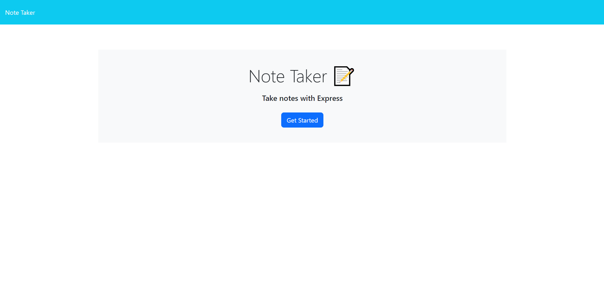
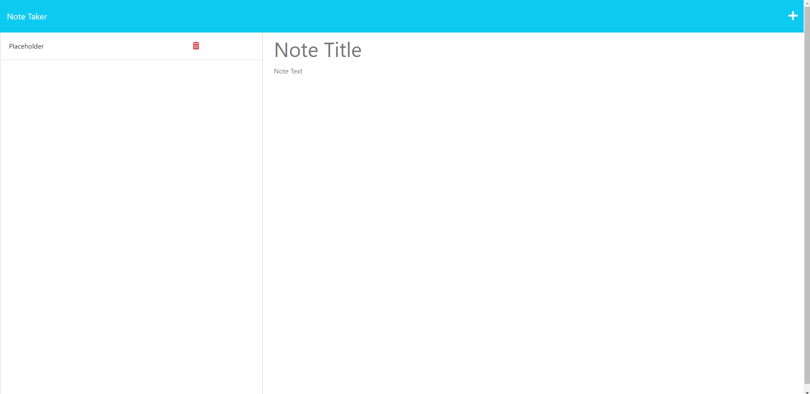
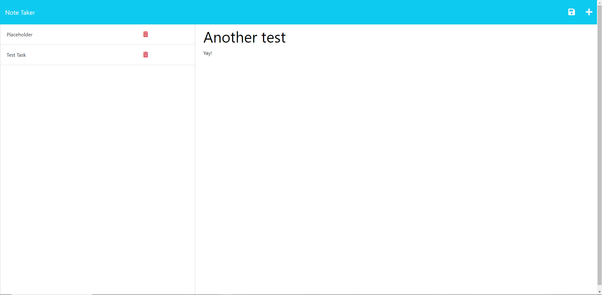

# noteTaker

## Description
This is a simple application that allows you to jot down notes throughout the whole day. Need to remember something? Use this! Keep up and never lose track with your day-to-day life.

## Features
1. Boot up the app buy pressing the big, blue button!
2. Add a title to your note in the ```Note Title`` field.
3. Add a description for your new task in the ```Note Text``` field.
4. Save the new note via the ```Save``` button in the top right!
5. Finished a task? You can delete it via the ```Delete``` button next to the task you want to delete!

## Installation and Usage
1. To use the application, just visit [this website](https://fathomless-sands-04961-0b52d1710617.herokuapp.com/) to use the application!

## Info
Here is the [GitHub Repository](https://github.com/Mizzymizu/noteTaker) for the code!

Here is the deployed [Heroku Application](https://fathomless-sands-04961-0b52d1710617.herokuapp.com/)!

## Deployment Samples




